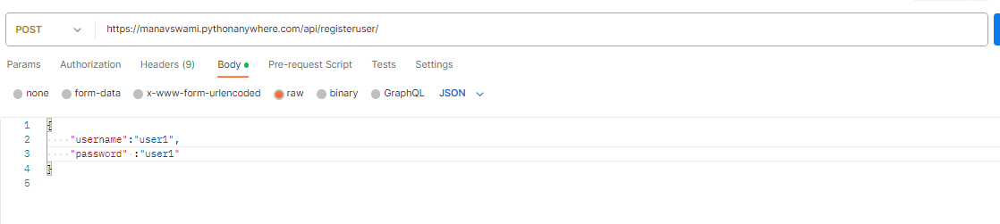

FOR USER REGISTRATION 
for user registration  we can will hbe using following url:

curl --location 'https://manavswami.pythonanywhere.com/api/registeruser/' \
--header 'Content-Type: application/json' \
--data '{
    "username":"user1",
    "password" :"user1"
}
'

api url : https://manavswami.pythonanywhere.com/api/registeruser/

body :

{
    "username":"2",
    "password":"2"
}

