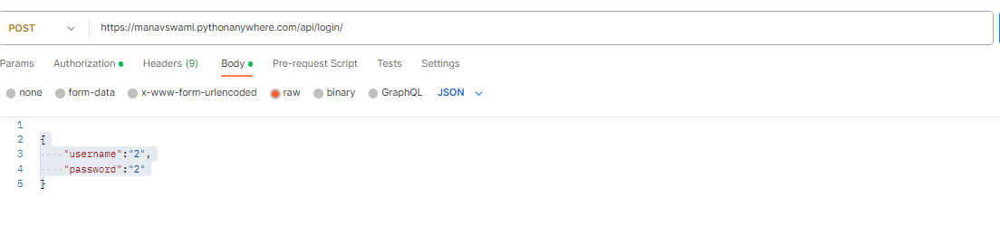

for log in we have to call the  following  curl 

curl --location 'https://manavswami.pythonanywhere.com/api/login/' \
--header 'Content-Type: application/json' \
--data '
{
    "username":"2",
    "password":"2"
}'

api url :https://manavswami.pythonanywhere.com/api/login/

body :

{
    "username":"2",
    "password":"2"
}

